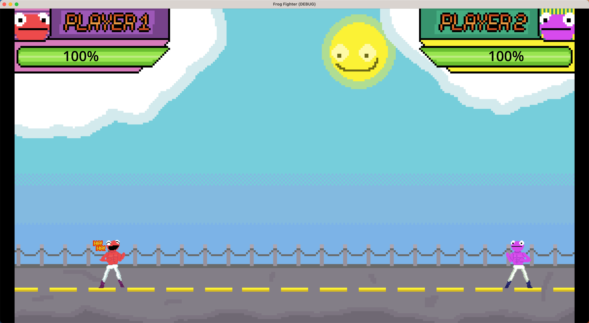

# Frog Fighters - Nashville Gamejam 2024

[Play Frog Fighters Online](https://bmingles.github.io/gamejam-2024/)

Judah (my 13 year old) and I participated in the January 2024 Nashville Gamejam. This is what we worked on.

The first night of the game jam, we were asked as an ice breaker excercise to pitch game ideas to each other related to the theme `"make me laugh"`. Judah pitched the idea of a Street Fighter like game where the characters hit each other with dead fish. We decided to run with the idea and produced "Frog Fighters". Judah created all of the art, picked sound effects, and helped with building the player controller while I did the reset of the coding.

The [official submission of Frog Fighters](https://globalgamejam.org/games/2024/frog-fighters-1) has been posted to the Global Gamejam site.

# Controls

Frog Fighters has minimal gamepad support (I used 2 different 8 bit do controllers. One of the attack buttons did not work on 1 controller, so no promises on compatibility here). It also supports keyboard controls.

- Player 1
  - Movement - a,s,d,f
  - Fish - c
  - Chicken - v
  - Laugh - b
- Player 2
  - Movement - arrow keys
  - Fish - ctrl
  - Chicken - alt / option
  - Laugh - space

## Tech Stack

- Godot 4 - game engine used for scripting the game
- Aseprite - used by Judah for pixel art + animations
